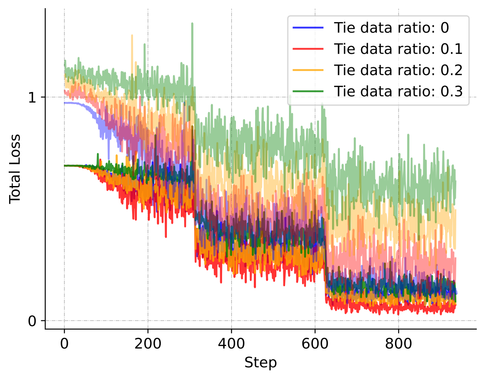

### 1. Hyperparameters settings of Baselines

##### For hyperparameter selection, we follow the approach outlined in SimPO's work ([SimPO GitHub Repository](https://github.com/princeton-nlp/SimPO)). For the parameter `ODPO_alpha`, we adhere to the default settings described in the ODPO paper ([ODPO Paper](http://arxiv.org/abs/2402.10571)) and maintain the same learning rate and batch size as those used for DPO and TODO in our experiments.

- **Mistral-7B**

| Methods | beta | λD/λU | ODPO_alpha | SimPO_gemma_beta | LR   | Batch Size |
| ------- | ---- | ----- | ---------- | ---------------- | ---- | ---------- |
| KTO     | 0.01 | 1.0   | /          | /                | 5e-7 | 64         |
| SImPO   | 2.0  | /     | /          | 0.8              | 5e-7 | 64         |
| ODPO    | 0.01 | /     | 1.0        | /                | 5e-7 | 64         |

- **Llama3-8B**

| Methods | beta | λD/λU | ODPO_alpha | SimPO_gemma_beta | LR   | Batch Size |
| ------- | ---- | ----- | ---------- | ---------------- | ---- | ---------- |
| KTO     | 0.01 | 1.0   | /          | /                | 1e-6 | 128        |
| SImPO   | 2.0  | /     | /          | 0.5              | 1e-6 | 128        |
| ODPO    | 0.01 | /     | 1.0        | /                | 1e-6 | 128         |

### 2. Convergence visualization of DPO and TODO considering different tie data ratios in train set.

##### In the visualization, the darker-colored loss variations represent the results of DPO, while the lighter-colored variations correspond to the results of TODO.

- **Mistral**

  - Total loss changes during training phase of DPO and TODO

  

  - Preference loss changes during training phase of DPO and TODO

  

- **Llama 3**

  - Total loss changes during training phase of DPO and TODO

  

  - Preference loss changes during training phase of DPO and TODO

  
